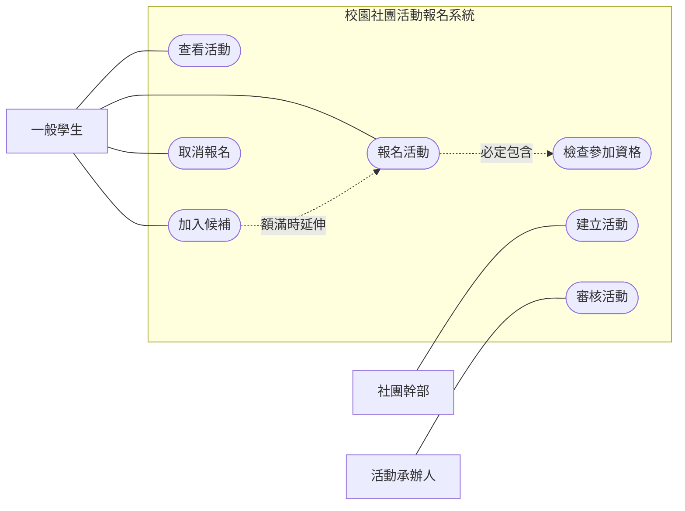
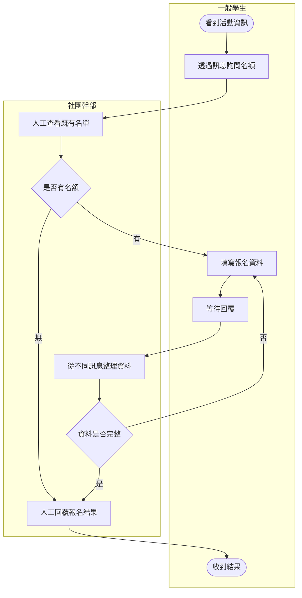
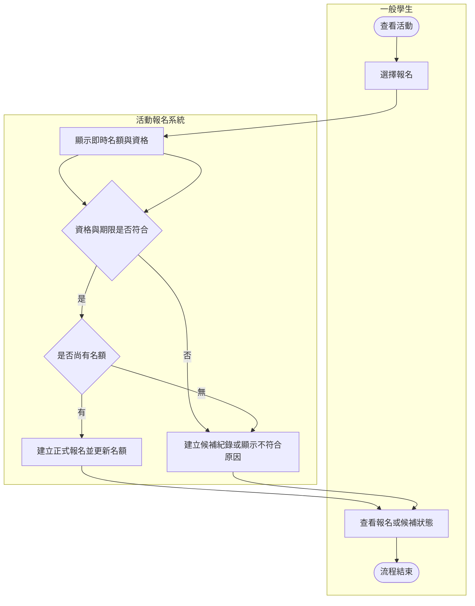

# 系統分析與設計：7/20 教材

## 單元名稱

使用案例（use case）、使用案例描述（Use Case Description）、現況／目標流程建模（AS-IS/TO-BE process modeling）與程式碼代理實作（code agent implementation）

## 課程名稱

系統分析與設計

## 課程定位

7/14 已經把需求來源整理成使用者故事（user story）、功能性需求（functional requirement, FR）、非功能性需求（non-functional requirement, NFR）、驗收條件（acceptance criteria）、需求優先順序（requirements prioritization）與需求文件包初稿（Requirements Package draft）。

7/20 要把文字需求轉成分析模型（Analysis Models），回答以下問題：

1. 哪些外部角色會與系統互動？
2. 每個角色使用系統要完成什麼目標？
3. 核心目標的正常、替代與例外流程是什麼？
4. 目前流程如何運作，問題發生在哪裡？
5. 目標流程要改善什麼，為什麼這樣改？
6. 流程需要哪些輸入資料、輸出資料與狀態變化？
7. 現有可操作切片是否符合需求與分析模型？

今天的完整工作鏈如下：

```text
需求來源與使用者故事
→ 參與者目標矩陣
→ 使用案例清單
→ 使用案例圖
→ 使用案例描述
→ 現況流程
→ 目標流程
→ 流程資料交換表
→ 模型一致性檢查
→ 實作待辦與程式碼代理任務書
→ 可操作切片修正
→ 手動驗收與追溯紀錄
```

今天完成後，每組應能交出：

1. 參與者目標矩陣（actor-goal matrix）。
2. 使用案例清單（use case inventory）。
3. 使用案例圖（Use Case Diagram）。
4. 至少 3 份使用案例描述（Use Case Descriptions）。
5. 現況流程模型（AS-IS process model）。
6. 目標流程模型（TO-BE process model）。
7. 流程問題與改善對照表（process problem-improvement mapping）。
8. 流程資料交換表（process data exchange table）。
9. 模型一致性矩陣（model consistency matrix）。
10. 更新後的程式碼代理實作任務書（updated code agent implementation brief）。
11. 修正版既有切片或第三個可操作切片（third working slice）。
12. 手動驗收測試紀錄（manual acceptance test record）。
13. GitHub 文件與版本管理平台（GitHub）更新紀錄。
14. 生成式 AI 使用紀錄（generative AI use log）。

## 進度規劃

| 節次 | 學習重點 | 主要產出 |
| --- | --- | --- |
| 02 | 從高優先需求找出參與者與使用案例 | 參與者目標矩陣、使用案例清單 |
| 03 | 建立使用案例圖，確認系統邊界與關係 | 使用案例圖 |
| 04 | 撰寫主要、替代與例外流程 | 至少 3 份使用案例描述 |
| 06 | 建立現況流程並標記痛點、交接與等待 | 現況泳道流程圖、流程問題清單 |
| 07 | 建立目標流程、改善對照與資料交換 | 目標泳道流程圖、改善對照表、流程資料交換表 |
| 08 | 檢查模型一致性，使用程式碼代理修正實作並驗收 | 一致性矩陣、實作任務書、可操作切片、手動驗收紀錄 |

## 學習目標

完成本單元後，你應能：

1. 從使用者故事與功能性需求辨識參與者（actor）及其目標。
2. 區分參與者、利害關係人、使用案例、畫面、功能與操作步驟。
3. 定義系統邊界（system boundary），避免把內部模組或資料庫誤當參與者。
4. 建立符合統一塑模語言（UML, Unified Modeling Language）基本規則的使用案例圖。
5. 正確使用關聯（association）、包含關係（include relationship）與延伸關係（extend relationship）。
6. 撰寫包含觸發事件、前置條件、後置條件、主要流程、替代流程與例外流程的使用案例描述。
7. 建立現況流程（AS-IS process），呈現目前角色、步驟、資料與問題。
8. 建立目標流程（TO-BE process），並說明每項改善對應的需求與痛點。
9. 使用泳道流程圖（swimlane process diagram）表達跨角色責任與系統行為。
10. 建立流程資料交換表，作為下一單元資料流程圖（DFD, Data Flow Diagram）的輸入。
11. 檢查需求、使用案例、流程、驗收條件與原型是否一致。
12. 把分析模型轉成實作待辦與程式碼代理實作任務書。
13. 使用程式碼代理修正既有切片或完成第三個可操作切片，但不讓工具自行改變需求與流程。
14. 將使用案例情境轉成可重現的手動驗收測試。

## 先備知識

開始前請準備：

1. 專案章程第 2 版（Project Charter v2）。
2. 需求文件包初稿（Requirements Package draft）。
3. 使用者故事清單（user story list）。
4. 功能性需求與非功能性需求清單（FR/NFR list）。
5. 驗收條件清單（acceptance criteria list）。
6. 需求優先順序表（requirements priority table）。
7. 需求追溯矩陣初稿（requirements traceability matrix draft）。
8. 第一或第二個可操作切片（working slice）。
9. 7/14 更新後的程式碼代理實作任務書。
10. 小組 GitHub 儲存庫（GitHub repository）。

如果 7/14 的需求仍有衝突或無來源項目，先列入未解決問題清單（open issues list）。分析模型不可替小組猜測尚未確認的需求。

## 問題情境

文字需求完成後，系統仍可能出現以下問題：

1. 同一個「報名活動」需求，不同組員理解成不同操作流程。
2. 使用案例圖把登入畫面、資料庫與按鈕都畫成參與者。
3. 圖上只有「管理系統」一個大橢圓，無法看出角色目標。
4. 使用案例描述只有正常流程，額滿、資格不符與重複報名沒有處理。
5. 目標流程看起來更短，但刪除了必要審核、權限或資料確認。
6. 原型已經有許多畫面，卻與需求、流程及驗收條件不一致。
7. 程式碼代理看見模糊流程後，自行增加登入、通知、付款或管理功能。
8. 下一步要畫資料流程圖時，才發現流程中沒有寫清楚輸入與輸出資料。

分析模型不是把需求重新畫一次。它的用途是發現文字需求中看不見的角色責任、流程斷點、例外條件、資料需求與實作衝突。

## 核心概念

### 概念 1：分析模型是需求與設計之間的橋梁

分析模型（Analysis Models）把需求轉成可檢查的結構：

```text
需求回答：系統為什麼需要、必須做什麼。
使用案例回答：哪個角色要透過系統完成什麼目標。
流程模型回答：角色與系統依什麼順序完成目標。
資料模型回答：流程需要、產生與保存哪些資料。
設計與實作回答：系統要如何實現上述行為。
```

分析模型如果與需求不一致，後續資料流程圖、實體關係圖、軟體需求規格書與原型都會跟著偏離。

### 概念 2：參與者是系統外部的角色

參與者（actor）是位於系統邊界外，會與系統交換資訊或要求系統提供服務的角色。

參與者可能是：

1. 人的角色，例如一般學生、社團幹部、活動承辦人。
2. 外部系統，例如校務身分驗證系統。
3. 外部裝置或時間事件，但必須真的會觸發系統行為。

參與者不是：

1. 某位同學的姓名。
2. 系統內部模組。
3. 資料庫。
4. 畫面或按鈕。
5. 沒有與系統互動的利害關係人。

利害關係人（stakeholder）不一定是參與者。受到系統影響但不直接操作系統的人，仍是利害關係人，但不一定畫在使用案例圖中。

### 概念 3：使用案例描述角色透過系統達成的目標

使用案例（use case）描述一個參與者與系統互動後所完成的、有明確價值的目標。

適合的使用案例名稱：

```text
查看活動
報名活動
取消報名
審核活動申請
查看報名狀態
```

不適合的名稱：

```text
按下按鈕
活動頁面
輸入姓名
資料庫
活動管理系統
```

使用案例名稱通常使用「動詞＋名詞」，並以參與者可理解的業務目標命名。

### 概念 4：一個使用案例應產生可辨識的結果

判斷是否為使用案例時，請問：

1. 哪個參與者啟動？
2. 參與者想完成什麼目標？
3. 完成後產生什麼可辨識結果？
4. 是否對參與者或組織有價值？
5. 是否能寫成一段完整互動流程？

「填寫活動名稱」只是步驟；「建立活動」才是使用案例。「按下送出」只是操作；「完成報名」才是目標。

### 概念 5：使用者故事與使用案例的粒度不同

使用者故事（user story）強調角色、需求與價值，適合整理工作與優先順序；使用案例強調角色與系統之間的完整互動。

| 比較面向 | 使用者故事 | 使用案例 |
| --- | --- | --- |
| 核心問題 | 誰想要什麼、為什麼 | 角色如何透過系統完成目標 |
| 長度 | 通常短 | 包含完整流程與例外 |
| 細節 | 驗收條件補充 | 主要、替代與例外流程補充 |
| 用途 | 溝通價值與安排工作 | 分析互動與系統責任 |
| 關係 | 一則故事可能對應多個使用案例 | 一個使用案例可能整合多則相關故事 |

轉換不是一對一抄寫，必須依角色目標重新整理。

### 概念 6：參與者目標矩陣先於畫圖

參與者目標矩陣（actor-goal matrix）用來確認每個角色真正要完成的目標：

| 參與者 | 目標 | 對應需求 | 觸發事件 | 成功結果 |
| --- | --- | --- | --- | --- |
| 一般學生 | 報名活動 | FR-05 | 選擇尚有名額的活動 | 建立報名紀錄並顯示成功狀態 |

先建立矩陣，可以避免畫出沒有需求來源的參與者與使用案例。

### 概念 7：系統邊界決定分析範圍

系統邊界（system boundary）表示本系統負責提供哪些服務。參與者在邊界外，使用案例在邊界內。

若本期不串接正式校務登入：

1. 校務登入系統可以標示為未來外部系統，或不放入本期使用案例圖。
2. 不可在圖中表示本系統已完成正式身分驗證。
3. 原型可以使用角色切換或假資料，但必須標示限制。

系統邊界應與專案章程的範圍內／範圍外項目一致。

### 概念 8：使用案例圖的基本元素

使用案例圖（Use Case Diagram）至少包含：

1. 系統名稱與系統邊界。
2. 參與者。
3. 使用案例。
4. 參與者與使用案例的關聯（association）。
5. 必要時使用包含、延伸或一般化關係。

使用案例圖不負責表示：

1. 操作先後順序。
2. 資料流向。
3. 畫面配置。
4. 資料表關係。
5. 程式模組呼叫。

這些內容應分別放入流程模型、資料流程圖、介面流程、實體關係圖或循序圖。

### 概念 9：關聯表示參與者會參與該使用案例

關聯（association）使用實線連接參與者與使用案例。它表示該參與者會啟動、參與或接收使用案例結果，不表示資料流方向。

同一參與者可以參與多個使用案例，同一使用案例也可以有主要與支援參與者。

### 概念 10：包含關係表示必定執行的共用行為

包含關係（include relationship）表示基礎使用案例執行時，必定使用另一個共用使用案例。

```text
「報名活動」包含「檢查參加資格」
```

只有當「檢查參加資格」是多個使用案例共用、且每次都必須執行時，才適合拆成被包含使用案例。

不要把每一個操作步驟都畫成包含關係，否則使用案例圖會變成流程圖。

### 概念 11：延伸關係表示條件成立時才發生的附加行為

延伸關係（extend relationship）表示在特定條件下，附加行為延伸基礎使用案例。

```text
「加入候補」延伸「報名活動」
條件：活動名額已滿且允許候補
```

延伸行為不是每次都執行，必須寫清楚發生條件。

### 概念 12：關係不是越多越完整

使用包含或延伸關係前，先問：

1. 拆開後是否真的更容易理解？
2. 是否有多個使用案例共用該行為？
3. 該行為是每次必定發生，還是條件成立才發生？
4. 若改寫在使用案例描述中，是否更清楚？

若只是為了讓圖看起來複雜，應保留簡單關聯即可。

### 概念 13：使用案例描述補足圖中沒有的流程

使用案例描述（Use Case Description）至少包含：

1. 使用案例編號與名稱。
2. 目標。
3. 主要參與者。
4. 支援參與者。
5. 觸發事件。
6. 前置條件（precondition）。
7. 成功後置條件（success postcondition）。
8. 最低保證（minimal guarantee）。
9. 主要流程（main flow）。
10. 替代流程（alternative flow）。
11. 例外流程（exception flow）。
12. 業務規則（business rules）。
13. 輸入、輸出與狀態變化。
14. 對應需求與驗收條件。
15. 待確認問題。

圖用來看全貌，描述用來檢查細節，兩者不可互相取代。

### 概念 14：主要流程只描述成功的標準路徑

主要流程（main flow）描述在條件正常時，參與者與系統如何完成目標。

建議寫法：

```text
1. 參與者執行動作。
2. 系統顯示、驗證、建立或更新資料。
3. 參與者根據系統回應繼續操作。
4. 系統產生成功結果。
```

每一步應能辨識責任方。避免使用「處理資料」「完成流程」等無法觀察的描述。

### 概念 15：替代流程仍可能成功完成目標

替代流程（alternative flow）是不同於主要流程，但仍可能完成或合理結束使用案例的路徑。

範例：活動額滿時，學生改為加入候補；報名資料有可修正缺漏時，系統提示後讓學生重新送出。

替代流程應標示從主要流程哪一步分支，以及完成後回到哪一步或如何結束。

### 概念 16：例外流程處理無法繼續的情況

例外流程（exception flow）處理錯誤、規則違反、資料不存在或系統無法完成操作的情況。

範例：

1. 學生不符合資格。
2. 活動已截止且不可候補。
3. 找不到活動資料。
4. 重複送出造成重複紀錄風險。

例外流程要說明系統如何保護資料、顯示原因，以及使用者下一步可以做什麼。

### 概念 17：前置條件與後置條件描述狀態

前置條件（precondition）是使用案例開始前必須已成立的狀態；後置條件（postcondition）是使用案例結束後可以確認的狀態。

```text
前置條件：活動存在且目前可接受報名。
成功後置條件：建立一筆報名紀錄，名額更新，學生看到報名狀態。
最低保證：若報名失敗，不建立不完整或重複紀錄，並保留可理解的失敗原因。
```

「使用者已打開網頁」通常不是重要前置條件；應記錄影響業務行為的資料與權限狀態。

### 概念 18：現況流程要描述現在真的怎麼做

現況流程（AS-IS process）描述系統導入前或改善前的實際工作方式，包括：

1. 參與角色。
2. 流程起點與終點。
3. 工作步驟。
4. 判斷點。
5. 交接點。
6. 使用的表單、訊息或資料。
7. 等待、重工、錯誤與風險。

現況流程不是故意把舊流程畫得很差，也不是直接把預想系統畫進去。每個步驟應有訪談、文件、觀察或合理情境依據。

### 概念 19：泳道流程圖顯示責任與交接

泳道流程圖（swimlane process diagram）依角色、部門或系統分區，將每個活動放在負責者的泳道中。

基本元素：

1. 開始與結束。
2. 活動或工作步驟。
3. 判斷與分支。
4. 流程方向。
5. 泳道。
6. 必要的資料或狀態註記。

若一個步驟跨越兩個泳道，應拆成提出、接收、處理或回覆等可辨識動作。

### 概念 20：現況痛點要能指出位置與影響

不夠好的寫法：

```text
流程很沒有效率。
```

較好的寫法：

```text
P-01：社團幹部必須從多則訊息手動合併報名資料，容易遺漏，且學生無法立即確認報名狀態。
位置：現況流程步驟 5 至 7。
影響：資料重複、等待時間增加、狀態不透明。
來源：SRC-STAFF-02。
```

每個痛點至少包含位置、現象、影響與來源。

### 概念 21：目標流程必須回應已確認的問題

目標流程（TO-BE process）描述系統導入或流程改善後，角色與系統如何合作完成目標。

每項改善都應回答：

1. 解決哪個現況痛點？
2. 對應哪項需求？
3. 由哪個角色或系統負責？
4. 是否保留必要的業務規則與人工判斷？
5. 是否新增資料、權限或風險？
6. 如何驗收改善結果？

目標流程不是單純把人工步驟全部刪除。需要審核、授權或例外判斷的步驟，仍應清楚保留。

### 概念 22：流程改善應有明確策略

常見改善策略：

1. 消除不必要的重複輸入。
2. 合併重複檢查。
3. 讓狀態可查詢。
4. 將固定規則交由系統檢查。
5. 保留需要專業判斷的人工審核。
6. 在錯誤發生點提供立即回饋。
7. 減少不必要的角色交接。
8. 保存可追溯的操作紀錄。

每個策略都要對應需求與驗收條件，不能只因技術上容易就加入。

### 概念 23：流程資料交換表為資料流程圖做準備

流程資料交換表（process data exchange table）記錄每個步驟的資料：

| 欄位 | 說明 |
| --- | --- |
| 流程步驟 | 對應現況或目標流程編號 |
| 執行者 | 參與者或系統 |
| 輸入資料 | 執行前需要什麼資料 |
| 處理或判斷 | 做什麼檢查、轉換或決策 |
| 輸出資料 | 產生或更新什麼資料 |
| 資料去向 | 提供給誰或保存在哪個概念資料集合 |
| 狀態變化 | 例如待審核變為已核准 |
| 對應需求 | 功能性需求、資料需求或業務規則 |

下一單元建立資料流程圖時，可以從這張表辨識外部實體、處理程序、資料流與資料儲存。

### 概念 24：模型一致性比圖的數量重要

模型一致性（model consistency）要檢查：

1. 每個高優先需求是否有使用案例或流程對應。
2. 使用案例圖中的核心使用案例是否有描述。
3. 描述中的主要、替代與例外流程是否出現在流程模型或驗收條件。
4. 流程使用的資料是否有資料需求或待確認紀錄。
5. 原型中的操作是否能找到需求、使用案例與流程依據。
6. 程式碼代理新增的行為是否超出模型。
7. 同一狀態與角色名稱是否前後一致。

單張圖看起來正確，不代表整套分析模型一致。

### 概念 25：模型變更必須沿追溯鏈更新

若在使用案例分析中發現「取消報名後必須釋出名額」，應同步檢查：

```text
需求與業務規則
→ 驗收條件
→ 使用案例描述
→ 目標流程
→ 流程資料交換表
→ 原型與實作
→ 手動驗收測試
```

不能只修改圖，留下文件與實作不一致。

### 概念 26：程式碼代理的輸入應來自分析模型

模型驅動實作任務書（model-driven implementation brief）至少包含：

1. 本次使用案例與目標。
2. 要實作的主要、替代或例外流程。
3. 前置與後置條件。
4. 輸入、輸出與狀態變化。
5. 對應需求與驗收條件。
6. 保留、修改、新增與刪除項目。
7. 範圍外功能。
8. 技術與資料限制。
9. 完成後回報格式。

程式碼代理（code agent）可以協助實作已確認流程，不能自行選擇尚未確認的業務規則。

### 概念 27：可操作切片要對應一段完整使用案例流程

今天的實作可二選一：

1. 修正既有切片：當第一或第二個切片與使用案例、目標流程或驗收條件不一致時，先修正。
2. 建立第三個可操作切片：當既有切片已通過核心驗收時，選擇一個高價值替代或例外流程實作。

適合的第三個切片：

1. 取消報名並釋出名額。
2. 額滿時加入候補。
3. 承辦人核准或退回申請。
4. 使用者查看處理狀態。

完成切片的標準不是畫面存在，而是從前置狀態、操作、資料變化到結果都能重現。

### 概念 28：使用案例情境可以轉成驗收測試

轉換方式：

```text
使用案例前置條件 → 測試前置資料
流程步驟 → 測試操作步驟
後置條件 → 預期結果
替代流程 → 替代情境測試
例外流程 → 失敗或保護測試
```

測試仍要記錄實際結果、通過／失敗、證據與修正後重測，不可只複製使用案例描述。

## 範例解析

以下沿用「校園社團活動報名系統」作為連續範例。範例規則只供練習，各組必須依自己的需求來源與專案範圍建立模型。

### 範例 1：參與者目標矩陣

| 參與者 | 目標 | 對應需求 | 觸發事件 | 成功結果 |
| --- | --- | --- | --- | --- |
| 一般學生 | 查看活動 | FR-01 | 想尋找可參加活動 | 看到符合條件的活動資料 |
| 一般學生 | 報名活動 | FR-05 | 選擇尚有名額的活動 | 建立報名紀錄並顯示成功狀態 |
| 一般學生 | 加入候補 | FR-07 | 活動額滿且允許候補 | 建立候補紀錄並顯示順位 |
| 一般學生 | 取消報名 | FR-09 | 無法參加且仍在可取消期間 | 報名狀態變更並釋出名額 |
| 社團幹部 | 建立活動 | FR-12 | 確認活動基本資料 | 建立待審核活動資料 |
| 活動承辦人 | 審核活動 | FR-15 | 收到待審核活動 | 活動狀態變為核准或退回 |

### 範例 2：使用案例清單

| 編號 | 使用案例 | 主要參與者 | 目標 | 對應需求 | 優先順序 |
| --- | --- | --- | --- | --- | --- |
| UC-01 | 查看活動 | 一般學生 | 找到可參加活動 | FR-01、NFR-01 | 必須有 |
| UC-02 | 報名活動 | 一般學生 | 取得參加資格 | FR-05、BR-02 | 必須有 |
| UC-03 | 加入候補 | 一般學生 | 在額滿時保留參加機會 | FR-07、BR-03 | 應該有 |
| UC-04 | 取消報名 | 一般學生 | 取消參加並更新名額 | FR-09、BR-04 | 應該有 |
| UC-05 | 建立活動 | 社團幹部 | 提交活動資料 | FR-12 | 必須有 |
| UC-06 | 審核活動 | 活動承辦人 | 核准或退回活動 | FR-15、BR-06 | 必須有 |

### 範例 3：使用案例圖



圖後仍需以文字註明：

1. `UC-02 報名活動`包含`UC-03 檢查參加資格`。
2. `UC-04 加入候補`在活動額滿且允許候補時延伸`UC-02 報名活動`。
3. 本期不串接正式登入，因此圖中不宣稱已有校務登入系統。

### 範例 4：完整使用案例描述

```text
使用案例編號：UC-02
使用案例名稱：報名活動

目標：一般學生完成符合資格且尚有名額之活動報名。

主要參與者：一般學生
支援參與者：無

觸發事件：學生在活動詳情選擇報名。

前置條件：
1. 活動存在且開放報名。
2. 學生尚未有正式報名或候補紀錄。

成功後置條件：
1. 建立一筆正式報名紀錄。
2. 活動剩餘名額減少 1。
3. 學生可看到報名成功與目前狀態。

最低保證：
1. 報名失敗時不建立不完整或重複紀錄。
2. 系統顯示失敗原因與可採取的下一步。

主要流程：
1. 學生查看活動詳情。
2. 系統顯示活動資格、報名期限與剩餘名額。
3. 學生選擇報名。
4. 系統檢查資格、報名期限、名額與既有紀錄。
5. 系統建立報名紀錄。
6. 系統更新剩餘名額。
7. 系統顯示報名成功與報名狀態。

替代流程 A1：資料缺漏
分支點：主要流程步驟 4。
1. 系統指出缺漏資料並保留其他有效輸入。
2. 學生補正資料後回到主要流程步驟 3。

替代流程 A2：活動額滿且允許候補
分支點：主要流程步驟 4。
1. 系統不得建立正式報名紀錄。
2. 系統提供加入候補操作。
3. 學生選擇加入候補後進入 UC-03。

例外流程 E1：資格不符
分支點：主要流程步驟 4。
1. 系統停止報名。
2. 系統顯示不符合資格的原因。
3. 使用案例結束，不建立報名紀錄。

例外流程 E2：已有紀錄
分支點：主要流程步驟 4。
1. 系統不得建立第二筆報名紀錄。
2. 系統顯示既有報名或候補狀態。
3. 使用案例結束。

對應需求：FR-05、FR-07、NFR-03、BR-02、DR-04
對應驗收條件：AC-05-01、AC-05-02、AC-05-03、AC-07-01
待確認問題：候補是否會自動遞補，本期不自行假設。
```

### 範例 5：現況流程



現況痛點：

| 痛點編號 | 流程位置 | 現象 | 影響 | 來源 |
| --- | --- | --- | --- | --- |
| P-01 | 詢問名額 | 每位學生分別詢問 | 重複回覆、狀態可能過期 | SRC-STU-01 |
| P-02 | 整理資料 | 資料分散在多則訊息 | 容易遺漏或重複 | SRC-STAFF-02 |
| P-03 | 等待回覆 | 學生無法自行查詢狀態 | 等待與重複詢問 | SRC-STU-03 |

### 範例 6：目標流程



### 範例 7：流程問題與改善對照

| 痛點 | 目標流程改善 | 對應需求 | 驗收方式 | 新風險或限制 |
| --- | --- | --- | --- | --- |
| P-01 名額需逐一詢問 | 系統顯示目前剩餘名額 | FR-01、NFR-01 | 名額狀態可由活動詳情查看 | 假資料環境不代表正式即時同步 |
| P-02 人工整合資料 | 報名資料以一致欄位建立紀錄 | FR-05、DR-04 | 成功報名後出現完整紀錄 | 需避免重複送出 |
| P-03 無法查詢狀態 | 學生可查看報名或候補狀態 | FR-08 | 不同狀態顯示正確文字 | 本期不提供外部通知 |

### 範例 8：流程資料交換表

| 步驟 | 執行者 | 輸入資料 | 處理或判斷 | 輸出資料 | 狀態變化 | 對應需求 |
| --- | --- | --- | --- | --- | --- | --- |
| T-01 | 系統 | 活動編號、目前時間 | 檢查活動與期限 | 活動詳情、報名狀態 | 無 | FR-01 |
| T-02 | 系統 | 學生資格、活動資格 | 比對資格規則 | 符合／不符合與原因 | 無 | FR-05、BR-02 |
| T-03 | 系統 | 剩餘名額、既有紀錄 | 檢查名額與重複 | 可報名／可候補／不可操作 | 無 | FR-05、FR-07 |
| T-04 | 系統 | 報名資料 | 建立正式報名 | 報名紀錄 | 無→已報名 | FR-05、DR-04 |
| T-05 | 系統 | 活動名額 | 扣除一個名額 | 最新剩餘名額 | 有名額→可能額滿 | FR-05 |

### 範例 9：模型一致性矩陣

| 需求 | 使用案例 | 使用案例流程 | 目標流程 | 畫面或操作 | 驗收條件 | 狀態 |
| --- | --- | --- | --- | --- | --- | --- |
| FR-05 | UC-02 | 主要流程 1-7 | T-01 至 T-05 | SCR-02 活動詳情 | AC-05-01 | 一致 |
| FR-07 | UC-03 | UC-02 替代流程 A2 | T-03 | SCR-02 候補操作 | AC-07-01 | 待實作 |
| NFR-03 | UC-02 | A1、E1、E2 | T-02、T-03 | SCR-02 錯誤訊息 | AC-NFR-03-01 | 部分一致 |

### 範例 10：模型驅動實作任務書摘要

```text
本次目標：完成「活動額滿時加入候補」替代流程。

對應模型：
- 使用案例：UC-03 加入候補
- 分支來源：UC-02 替代流程 A2
- 目標流程：T-03
- 需求：FR-07、FR-08、BR-03
- 驗收條件：AC-07-01、AC-07-02、AC-07-03

前置狀態：
- 活動已額滿
- 學生符合資格
- 學生沒有正式報名或候補紀錄

要完成：
1. 顯示加入候補操作。
2. 建立候補紀錄。
3. 顯示候補順位與狀態。
4. 防止重複建立候補紀錄。

本次不做：
1. 正式登入。
2. 外部通知。
3. 自動遞補。
4. 正式資料庫串接。

完成後必須回報修改檔案、操作方式、對應驗收條件、已知限制與未完成項目。
```

### 範例 11：使用案例轉成手動驗收測試

| 測試編號 | 使用案例情境 | 前置資料 | 操作 | 預期結果 |
| --- | --- | --- | --- | --- |
| MAT-UC02-01 | 主要流程 | 尚有名額、符合資格、無既有紀錄 | 完成報名 | 建立正式報名、名額減少、顯示成功 |
| MAT-UC02-02 | 替代流程 A2 | 額滿、允許候補、無既有紀錄 | 選擇加入候補 | 建立候補紀錄並顯示順位 |
| MAT-UC02-03 | 例外流程 E1 | 不符合資格 | 嘗試報名 | 不建立紀錄並顯示原因 |
| MAT-UC02-04 | 例外流程 E2 | 已有報名紀錄 | 再次嘗試報名 | 不建立重複紀錄並顯示目前狀態 |

## 學生任務

### 任務 0：確認分析基準版本

開始建模前，先確認：

1. 使用哪一版需求文件包。
2. 哪些需求屬於本期範圍。
3. 哪些需求仍待確認。
4. 哪三項使用者目標優先分析。
5. 現有可操作切片是哪一個版本。

完成標準：所有模型使用相同需求版本與術語；待確認需求不直接畫成已確認流程。

### 任務 1：建立參與者目標矩陣

從利害關係人分析、使用者故事與高優先需求找出參與者。

最低要求：

1. 至少 3 種參與者。
2. 每個參與者至少有 1 個明確目標。
3. 至少整理 6 個參與者目標。
4. 每個目標都對應需求編號。
5. 每個目標都有觸發事件與成功結果。
6. 沒有把資料庫、畫面或內部模組列為參與者。

完成標準：另一位同學能從矩陣理解每個角色為什麼要使用系統。

### 任務 2：建立使用案例清單

將參與者目標整理成至少 6 個使用案例。

每個使用案例包含：

1. 使用案例編號。
2. 動詞加名詞的名稱。
3. 主要參與者。
4. 支援參與者。
5. 目標與成功結果。
6. 對應需求。
7. 優先順序。
8. 是否需要完整描述。

完成標準：使用案例是完整目標，不是畫面、欄位、按鈕或單一步驟。

### 任務 3：建立使用案例圖

使用 draw.io 線上繪圖工具（draw.io）、Mermaid 圖表語法（Mermaid）或其他可匯出圖檔的工具建立使用案例圖。

最低要求：

1. 有系統名稱與系統邊界。
2. 至少 3 種參與者。
3. 至少 6 個使用案例。
4. 每個核心使用案例至少連接一個參與者。
5. 關聯方向與名稱清楚。
6. 包含或延伸關係若有使用，必須說明理由與條件。
7. 圖中的項目都能回到使用案例清單與需求。
8. 匯出可閱讀的圖片或可開啟的原始檔。

完成標準：圖能回答「哪些角色透過系統完成哪些目標」，不混入流程順序、資料庫或畫面配置。

### 任務 4：撰寫使用案例描述

選擇至少 3 個高優先使用案例撰寫完整描述。

最低要求：

1. 至少 3 份使用案例描述。
2. 每份都有觸發事件、前置條件、成功後置條件與最低保證。
3. 每份都有主要流程。
4. 三份合計至少 3 個替代流程。
5. 三份合計至少 3 個例外流程。
6. 每個流程分支標示分支點與結束方式。
7. 每份都對應需求、業務規則與驗收條件。
8. 有輸入、輸出與狀態變化。

完成標準：另一位同學能依描述走完正常與失敗情境，不需要自行補規則。

### 任務 5：建立現況流程

選擇一個與核心問題直接相關的現況流程，建立泳道流程圖。

最低要求：

1. 至少 2 個角色泳道。
2. 明確開始與結束。
3. 至少 8 個可辨識步驟。
4. 至少 2 個判斷或分支。
5. 標示角色交接。
6. 標示至少 3 個痛點。
7. 每個痛點有來源、位置與影響。
8. 不把尚未存在的系統功能畫進現況流程。

完成標準：現況流程呈現目前實際做法，並能指出問題發生在哪一步。

### 任務 6：建立目標流程

以相同流程範圍建立改善後的目標流程。

最低要求：

1. 起點與終點可與現況流程比較。
2. 每個現況痛點至少有一項對應改善或保留理由。
3. 每項改善對應需求與驗收條件。
4. 保留必要的人工判斷、權限與審核。
5. 包含至少一個替代或例外路徑。
6. 清楚標示系統與角色責任。
7. 不加入範圍外功能。

完成標準：目標流程不是單純縮短步驟，而是能說明改善價值、限制與新風險。

### 任務 7：建立流程問題與改善對照表

至少整理 3 組現況問題與目標改善。

每組包含：

1. 痛點編號。
2. 現況流程位置。
3. 問題與影響。
4. 目標流程改善。
5. 對應需求。
6. 驗收方式。
7. 新風險或限制。
8. 是否需要利害關係人確認。

完成標準：每項改善都有理由，且沒有把程式碼代理建議當成需求證據。

### 任務 8：建立流程資料交換表

從目標流程選擇至少 8 個重要步驟，整理資料交換。

每筆包含：

1. 流程步驟編號。
2. 執行者。
3. 輸入資料。
4. 處理或判斷。
5. 輸出資料。
6. 資料去向。
7. 狀態變化。
8. 對應需求。

完成標準：表格足以協助下一單元辨識外部實體、處理程序、資料流與資料儲存。

### 任務 9：執行模型一致性檢查

選擇至少 8 筆高優先需求建立一致性矩陣。

檢查：

1. 需求是否有使用案例。
2. 使用案例是否有描述。
3. 流程是否涵蓋主要、替代與例外情境。
4. 驗收條件是否可由流程重現。
5. 畫面或系統行為是否符合模型。
6. 使用的資料與狀態是否有依據。
7. 是否存在模型有、實作無，或實作有、模型無的情況。

完成標準：至少找出 2 個一致性問題，或以具體證據說明目前核心模型一致。

### 任務 10：建立模型驅動實作待辦

從一致性問題或下一個高價值流程選擇本次實作範圍。

每筆待辦包含：

1. 待辦編號。
2. 對應使用案例與流程分支。
3. 對應需求與驗收條件。
4. 前置與後置狀態。
5. 要修改的畫面、資料與行為。
6. 完成標準。
7. 驗證方式。
8. 本次不做項目。

最低要求：至少 4 筆實作待辦。

完成標準：每筆待辦都能單獨執行與驗收，且沒有超出分析模型。

### 任務 11：更新程式碼代理實作任務書

任務書必須包含：

1. 現有實作狀態。
2. 本次使用案例與流程分支。
3. 前置與後置條件。
4. 輸入、輸出與狀態變化。
5. 保留、修正、新增與刪除項目。
6. 技術與資料限制。
7. 範圍外功能。
8. 對應需求與驗收條件。
9. 完成後回報格式。
10. 不可自行判斷的規則與待確認問題。

完成標準：程式碼代理不需要猜測角色、流程與完成條件，也不會誤以為可以擴大系統範圍。

### 任務 12：修正既有切片或建立第三個切片

依小組目前狀態二選一：

1. 模型修正型：修正既有切片中與需求、使用案例或目標流程不一致的部分。
2. 流程延伸型：建立第三個可操作切片，完成一個替代或例外流程。

共同要求：

1. 只處理實作待辦清單中的工作。
2. 使用假資料與繁體中文介面，除非需求已有其他確認。
3. 不加入正式登入、付款、外部通知或正式資料庫等範圍外功能。
4. 每個修改都能回到使用案例流程與驗收條件。
5. 保留提示詞、產出摘要、採用、不採用與人工修正紀錄。

完成標準：至少一段主要、替代或例外流程可從前置狀態操作到明確結果，並通過至少 4 筆驗收條件。

### 任務 13：執行手動驗收與重測

將使用案例情境轉成至少 6 筆手動驗收測試。

最低要求：

1. 至少 2 筆主要流程測試。
2. 至少 2 筆替代流程測試。
3. 至少 2 筆例外流程測試。
4. 每筆有前置資料、操作、預期與實際結果。
5. 每筆有通過或失敗判定。
6. 至少保存 3 份測試證據。
7. 失敗項目有修正待辦與重測結果。

完成標準：測試能由另一位同學重現，且保留原始失敗與修正過程。

### 任務 14：更新 GitHub 文件與版本管理平台

建立資料夾：

```text
0720_Use_Case_Process_Modeling_Implementation/
├── README.md
├── actor_goal_matrix.md
├── use_case_inventory.md
├── use_case_diagram.png
├── use_case_diagram_source/
├── use_case_descriptions.md
├── as_is_process.png
├── to_be_process.png
├── process_model_sources/
├── process_problem_improvement.md
├── process_data_exchange.md
├── model_consistency_matrix.md
├── implementation_backlog.md
├── updated_code_agent_brief.md
├── manual_acceptance_test.md
├── ai_code_agent_log.md
├── evidence/
└── revised_or_third_working_slice/
```

專案說明檔（README）至少包含：

1. 今日分析範圍。
2. 主要參與者與使用案例。
3. 現況問題與目標改善摘要。
4. 本次實作選擇與操作方式。
5. 已通過與未通過的驗收條件。
6. 已知限制與待確認問題。
7. 所有成果連結。
8. 本次提交紀錄（commit）識別碼。

完成標準：連結可開啟，模型原始檔、匯出圖、實作、測試證據與人工判斷紀錄完整。

## 0720 工作紙

### A. 小組基本資料

```text
課程名稱：系統分析與設計
日期：115/07/20
小組名稱：
專案名稱：
組員與分工：
GitHub 儲存庫連結：
需求文件包版本：
現有可操作切片版本：
```

### B. 分析基準確認

| 項目 | 版本或連結 | 狀態 | 待處理問題 |
| --- | --- | --- | --- |
| 專案章程 |  |  |  |
| 需求文件包 |  |  |  |
| 優先需求 |  |  |  |
| 驗收條件 |  |  |  |
| 需求追溯矩陣 |  |  |  |
| 可操作切片 |  |  |  |

### C. 參與者目標矩陣

| 參與者編號 | 參與者 | 目標 | 觸發事件 | 成功結果 | 對應需求 | 來源 |
| --- | --- | --- | --- | --- | --- | --- |
| ACT-01 |  |  |  |  |  |  |
| ACT-02 |  |  |  |  |  |  |
| ACT-03 |  |  |  |  |  |  |
|  |  |  |  |  |  |  |
|  |  |  |  |  |  |  |
|  |  |  |  |  |  |  |

### D. 使用案例清單

| 編號 | 使用案例名稱 | 主要參與者 | 支援參與者 | 目標與成功結果 | 對應需求 | 優先順序 | 完整描述 |
| --- | --- | --- | --- | --- | --- | --- | --- |
| UC-01 |  |  |  |  |  |  |  |
| UC-02 |  |  |  |  |  |  |  |
| UC-03 |  |  |  |  |  |  |  |
| UC-04 |  |  |  |  |  |  |  |
| UC-05 |  |  |  |  |  |  |  |
| UC-06 |  |  |  |  |  |  |  |

### E. 使用案例圖檢查

| 檢查項目 | 完成 | 問題與修正 |
| --- | --- | --- |
| 有系統名稱與邊界 |  |  |
| 參與者在系統邊界外 |  |  |
| 使用案例在系統邊界內 |  |  |
| 每個使用案例名稱為角色目標 |  |  |
| 每個核心使用案例有參與者 |  |  |
| 沒有把資料庫或畫面當參與者 |  |  |
| 包含與延伸關係使用正確 |  |  |
| 每個圖中項目有需求依據 |  |  |
| 圖檔可閱讀且原始檔可開啟 |  |  |

### F. 使用案例描述

```text
使用案例編號：
使用案例名稱：

目標：
主要參與者：
支援參與者：
觸發事件：

前置條件：

成功後置條件：

最低保證：

主要流程：
1.
2.
3.

替代流程：
- 編號：
- 分支點：
- 條件：
- 步驟：
- 結束或返回位置：

例外流程：
- 編號：
- 分支點：
- 條件：
- 系統處理：
- 結束狀態：

業務規則：
輸入資料：
輸出資料：
狀態變化：
對應需求：
對應驗收條件：
待確認問題：
```

### G. 現況流程範圍

```text
流程名稱：
流程目的：
開始事件：
結束事件：
包含角色：
流程來源：
不包含範圍：
```

### H. 現況流程步驟

| 步驟 | 負責角色 | 動作 | 輸入或使用資料 | 輸出或狀態 | 下一步 | 問題 |
| --- | --- | --- | --- | --- | --- | --- |
| A-01 |  |  |  |  |  |  |
| A-02 |  |  |  |  |  |  |
| A-03 |  |  |  |  |  |  |
| A-04 |  |  |  |  |  |  |
| A-05 |  |  |  |  |  |  |
| A-06 |  |  |  |  |  |  |
| A-07 |  |  |  |  |  |  |
| A-08 |  |  |  |  |  |  |

### I. 現況痛點

| 痛點編號 | 流程位置 | 現象 | 影響 | 來源 | 嚴重度 |
| --- | --- | --- | --- | --- | --- |
| P-01 |  |  |  |  |  |
| P-02 |  |  |  |  |  |
| P-03 |  |  |  |  |  |

### J. 目標流程步驟

| 步驟 | 負責角色或系統 | 動作 | 輸入資料 | 處理或判斷 | 輸出或狀態 | 對應需求 |
| --- | --- | --- | --- | --- | --- | --- |
| T-01 |  |  |  |  |  |  |
| T-02 |  |  |  |  |  |  |
| T-03 |  |  |  |  |  |  |
| T-04 |  |  |  |  |  |  |
| T-05 |  |  |  |  |  |  |
| T-06 |  |  |  |  |  |  |
| T-07 |  |  |  |  |  |  |
| T-08 |  |  |  |  |  |  |

### K. 流程問題與改善對照

| 痛點 | 目標改善 | 對應需求 | 驗收方式 | 新風險或限制 | 待確認 |
| --- | --- | --- | --- | --- | --- |
| P-01 |  |  |  |  |  |
| P-02 |  |  |  |  |  |
| P-03 |  |  |  |  |  |

### L. 流程資料交換表

| 目標流程步驟 | 執行者 | 輸入資料 | 處理或判斷 | 輸出資料 | 資料去向 | 狀態變化 | 對應需求 |
| --- | --- | --- | --- | --- | --- | --- | --- |
|  |  |  |  |  |  |  |  |
|  |  |  |  |  |  |  |  |
|  |  |  |  |  |  |  |  |
|  |  |  |  |  |  |  |  |
|  |  |  |  |  |  |  |  |
|  |  |  |  |  |  |  |  |
|  |  |  |  |  |  |  |  |
|  |  |  |  |  |  |  |  |

### M. 模型一致性矩陣

| 需求 | 使用案例 | 使用案例流程 | 目標流程 | 資料與狀態 | 畫面或操作 | 驗收條件 | 狀態與問題 |
| --- | --- | --- | --- | --- | --- | --- | --- |
|  |  |  |  |  |  |  |  |
|  |  |  |  |  |  |  |  |
|  |  |  |  |  |  |  |  |
|  |  |  |  |  |  |  |  |
|  |  |  |  |  |  |  |  |
|  |  |  |  |  |  |  |  |
|  |  |  |  |  |  |  |  |
|  |  |  |  |  |  |  |  |

### N. 模型一致性問題

| 問題編號 | 問題類型 | 涉及項目 | 問題說明 | 修正方式 | 負責人 | 狀態 |
| --- | --- | --- | --- | --- | --- | --- |
| MC-01 |  |  |  |  |  |  |
| MC-02 |  |  |  |  |  |  |
| MC-03 |  |  |  |  |  |  |

### O. 模型驅動實作待辦

| 待辦編號 | 使用案例與流程 | 需求與驗收 | 前置／後置狀態 | 修改內容 | 完成標準 | 驗證方式 | 狀態 |
| --- | --- | --- | --- | --- | --- | --- | --- |
| IMP-01 |  |  |  |  |  |  |  |
| IMP-02 |  |  |  |  |  |  |  |
| IMP-03 |  |  |  |  |  |  |  |
| IMP-04 |  |  |  |  |  |  |  |

### P. 更新後的程式碼代理實作任務書

```text
一、專案與目前狀態

二、本次使用案例與目標

三、本次要完成的流程
- 主要流程：
- 替代流程：
- 例外流程：

四、前置與後置條件

五、輸入、輸出與狀態變化

六、保留項目

七、修正項目

八、新增項目

九、刪除項目

十、本次不做

十一、技術與資料限制

十二、對應需求與驗收條件

十三、不可自行判斷事項

十四、完成後回報
1. 修改檔案與用途
2. 操作方式
3. 對應使用案例、流程與驗收條件
4. 已完成與未完成待辦
5. 已知限制
6. 需要人工驗收之處
```

### Q. 程式碼代理執行紀錄

| 次數 | 目的 | 使用工具 | 提示詞位置 | 產出摘要 | 採用 | 不採用 | 人工修正 | 提交紀錄 |
| --- | --- | --- | --- | --- | --- | --- | --- | --- |
| 1 | 檢查實作計畫 |  |  |  |  |  |  |  |
| 2 | 執行模型修正 |  |  |  |  |  |  |  |
| 3 | 依驗收失敗修正 |  |  |  |  |  |  |  |
| 4 | 檢查範圍與一致性 |  |  |  |  |  |  |  |

### R. 手動驗收測試

| 測試編號 | 使用案例情境 | 前置資料 | 操作步驟 | 預期結果 | 實際結果 | 通過／失敗 | 證據 | 修正與重測 |
| --- | --- | --- | --- | --- | --- | --- | --- | --- |
| MAT-01 | 主要 |  |  |  |  |  |  |  |
| MAT-02 | 主要 |  |  |  |  |  |  |  |
| MAT-03 | 替代 |  |  |  |  |  |  |  |
| MAT-04 | 替代 |  |  |  |  |  |  |  |
| MAT-05 | 例外 |  |  |  |  |  |  |  |
| MAT-06 | 例外 |  |  |  |  |  |  |  |

### S. 今日完成檢查

| 成果 | 完成 | 檔案或連結 | 尚待處理 |
| --- | --- | --- | --- |
| 參與者目標矩陣 |  |  |  |
| 使用案例清單 |  |  |  |
| 使用案例圖 |  |  |  |
| 使用案例描述 |  |  |  |
| 現況流程 |  |  |  |
| 目標流程 |  |  |  |
| 問題與改善對照 |  |  |  |
| 流程資料交換表 |  |  |  |
| 模型一致性矩陣 |  |  |  |
| 模型驅動實作待辦 |  |  |  |
| 程式碼代理任務書 |  |  |  |
| 修正版或第三個切片 |  |  |  |
| 手動驗收測試 |  |  |  |
| GitHub 與生成式 AI（generative AI）使用紀錄 |  |  |  |

## 程式碼代理使用建議

### 提示詞 1：檢查參與者與使用案例

```text
請檢查以下需求、參與者目標矩陣與使用案例清單。

逐項確認：
1. 參與者是否為系統外部角色
2. 是否誤把資料庫、畫面、按鈕或內部模組當成參與者
3. 使用案例是否為角色可辨識的完整目標
4. 使用案例名稱是否使用動詞加名詞
5. 每個使用案例是否有需求與來源依據
6. 是否有重複、過大、過小或範圍外使用案例
7. 主要參與者與成功結果是否清楚

只提出問題與修正建議，不要新增需求、角色或業務規則。

[貼上需求、參與者目標矩陣與使用案例清單]
```

### 提示詞 2：檢查使用案例描述

```text
請根據需求與驗收條件檢查以下使用案例描述。

檢查：
1. 觸發事件、前置條件與後置條件是否為明確狀態
2. 主要流程是否能完成使用者目標
3. 每一步是否清楚區分參與者與系統責任
4. 替代流程是否標示分支點與返回位置
5. 例外流程是否說明資料保護、失敗原因與結束狀態
6. 業務規則、輸入、輸出與狀態變化是否一致
7. 是否能對應需求與驗收條件
8. 是否加入來源中沒有的流程

若資訊不足，列為待確認問題，不要自行補造規則。

[貼上需求、驗收條件與使用案例描述]
```

### 提示詞 3：比較現況與目標流程

```text
請比較以下現況流程與目標流程。

請列出：
1. 每個現況痛點位於哪個步驟
2. 目標流程如何處理該痛點
3. 每項改善對應的需求與驗收條件
4. 被刪除、合併、自動化或保留的步驟
5. 是否刪除了必要的權限、審核或人工判斷
6. 是否新增未經確認的資料、角色或外部系統
7. 新流程可能產生的風險與待確認問題

不要自行判斷未提供的業務規則。

[貼上現況流程、目標流程、需求與痛點清單]
```

### 提示詞 4：檢查模型一致性

```text
請檢查需求、使用案例、流程、驗收條件與目前實作的一致性。

找出：
1. 有需求但沒有使用案例或流程的項目
2. 有使用案例但沒有需求來源的項目
3. 圖中存在但描述中不存在的流程
4. 替代或例外流程沒有驗收條件的項目
5. 流程使用但需求未定義的資料或狀態
6. 實作存在但模型與需求都沒有的功能
7. 模型要求但實作尚未支援的功能
8. 角色、狀態與名詞前後不一致之處

請以問題清單輸出，附上涉及編號與建議修正位置。不要自行新增需求。

[貼上需求、使用案例、流程、驗收條件、畫面對照與實作摘要]
```

### 提示詞 5：產生模型驅動實作計畫

```text
請根據以下已確認的使用案例、目標流程與驗收條件，產生實作計畫。先不要修改程式碼。

每筆待辦包含：
1. 對應使用案例與流程分支
2. 對應需求與驗收條件
3. 前置與後置狀態
4. 要修改的畫面、資料與行為
5. 可能影響的檔案
6. 完成標準
7. 手動驗證方式
8. 建議執行順序

限制：
1. 不加入模型以外的功能
2. 不自行更改業務規則
3. 不加入本次範圍外的正式登入、付款、通知或資料庫串接
4. 發現衝突或資訊不足時列為待確認，不要推測

[貼上模型驅動實作任務書與目前實作摘要]
```

### 提示詞 6：執行模型驅動實作

```text
請依照已確認的模型驅動實作待辦，修正既有切片或完成第三個可操作切片。

執行規則：
1. 依待辦順序處理
2. 每次修改都說明對應使用案例、流程步驟與驗收條件
3. 保留不需修改且已通過驗收的功能
4. 移除明確列為範圍外的功能
5. 使用假資料與繁體中文介面
6. 不新增未確認的角色、規則、資料欄位或外部服務
7. 遇到需求衝突時停止該項工作並回報

完成後列出：
1. 已完成與未完成待辦
2. 修改檔案與用途
3. 操作方式
4. 使用案例與驗收條件對應
5. 已知限制
6. 建議人工驗收項目

[貼上實作任務書與待辦清單]
```

### 提示詞 7：由使用案例建立驗收測試草稿

```text
請將以下使用案例的主要、替代與例外流程轉成手動驗收測試草稿。

每筆測試包含：
1. 測試編號
2. 對應使用案例流程
3. 對應需求與驗收條件
4. 前置資料
5. 操作步驟
6. 預期結果
7. 需要保存的證據

請勿宣稱測試已通過。實際結果、通過或失敗、人工修正與重測必須由小組操作後記錄。

[貼上使用案例描述與驗收條件]
```

## 常見錯誤與診斷

| 錯誤症狀 | 最可能原因 | 診斷問題 | 可驗證的修正步驟 |
| --- | --- | --- | --- |
| 把所有利害關係人都畫成參與者 | 混淆受影響者與直接互動角色 | 該角色是否真的與系統交換資訊？ | 回到角色目標與互動證據，移除無互動角色 |
| 把資料庫畫成參與者 | 混淆系統內外邊界 | 資料庫是否由本系統內部控制？ | 移到後續架構或資料模型，不放在使用案例圖 |
| 使用案例名稱是頁面或按鈕 | 把介面元素當成角色目標 | 完成後產生什麼使用者價值？ | 改成動詞加名詞的完整目標 |
| 圖中只有「管理系統」 | 粒度過大 | 哪些角色要完成哪些不同目標？ | 用參與者目標矩陣拆成多個使用案例 |
| 圖中每一步都有一個橢圓 | 把使用案例圖當流程圖 | 該項目能否獨立產生有價值結果？ | 步驟移到使用案例描述或流程圖 |
| 包含與延伸關係到處都是 | 為複雜而複雜 | 是必定共用，還是條件發生？ | 無法清楚回答時改為一般關聯或文字流程 |
| 使用案例描述只有正常流程 | 忽略失敗與邊界 | 資料缺漏、資格不符、重複操作時如何處理？ | 補上替代與例外流程並對應驗收條件 |
| 前置條件寫成第一個操作 | 混淆狀態與步驟 | 開始前必須已成立什麼？ | 改寫為角色、資料、時間或權限狀態 |
| 現況流程已經出現預計開發的系統 | 把目標流程倒填為現況 | 此功能現在真的存在嗎？ | 回到訪談或文件證據重畫現況 |
| 痛點只寫效率不好 | 缺少位置與影響 | 哪一步、誰受影響、造成什麼結果？ | 補流程位置、現象、影響與來源 |
| 目標流程刪除所有人工審核 | 把自動化當作唯一改善 | 哪些規則需要授權或判斷？ | 恢復必要人工決策並明確標責任 |
| 目標流程增加許多新功能 | 沒有範圍控制 | 每個新增步驟對應哪項需求？ | 無需求依據者刪除或列為待確認 |
| 流程有動作但沒有資料 | 沒有記錄輸入與輸出 | 執行判斷需要什麼、產生什麼？ | 建立流程資料交換表 |
| 模型與原型狀態名稱不同 | 缺少一致性檢查 | 同一狀態是否有兩種名稱？ | 選定標準術語並同步文件與實作 |
| 程式碼代理實作了模型外功能 | 任務書未限制範圍 | 是否列出本次不做與不可判斷項目？ | 更新任務書、刪除越界功能並保留紀錄 |
| 測試只重跑正常流程 | 沒有使用替代與例外情境 | 使用案例描述中的分支是否都被測試？ | 每種流程至少建立對應測試 |

診斷紀錄：

```text
目前看到的症狀：
最可能的原因：
涉及的需求或模型編號：
下一個可驗證的修正步驟：
修正後如何重測：
```

## 形成性評量

### 檢核 1：參與者判斷

請判斷「一般學生、活動資料庫、社團幹部、報名頁面、外部身分驗證系統」哪些可能是參與者，並說明理由。

參考答案：一般學生、社團幹部與確實交換資訊的外部身分驗證系統可能是參與者；活動資料庫通常是系統內部資源，報名頁面是介面，不是參與者。

### 檢核 2：使用案例命名

請修正：

```text
活動頁面
輸入學號
報名按鈕
系統管理
```

參考方向：查看活動、報名活動、建立活動、審核活動。實際名稱要依角色目標與需求決定。

### 檢核 3：包含與延伸

「報名活動每次都必須檢查參加資格」較適合哪一種關係？「活動額滿時才提供加入候補」較適合哪一種關係？

參考答案：前者可使用包含關係；後者可使用延伸關係，並標示活動額滿且允許候補的條件。

### 檢核 4：流程分類

請判斷：

1. 資料缺漏後補正並繼續報名。
2. 資格不符後停止報名且不建立紀錄。
3. 尚有名額時成功建立報名。

參考答案：依序為替代流程、例外流程、主要流程。

### 檢核 5：現況與目標流程

為什麼目標流程不能直接刪除所有人工審核？

可接受答案：人工審核可能承擔授權、例外判斷、責任歸屬或法規要求；只有在需求與規則確認可自動化時才能改由系統處理。

### 檢核 6：模型一致性

使用案例描述要求取消報名後釋出名額，但目標流程與原型只改變報名狀態，沒有更新名額。應如何處理？

參考答案：記錄模型一致性問題，確認對應業務規則與驗收條件，更新目標流程、資料狀態、實作待辦、原型與測試，不可只改其中一處。

### 檢核 7：程式碼代理判斷

程式碼代理建議在候補流程加入自動電子郵件通知，但需求與模型沒有此項內容。應如何處理？

參考答案：本次不採用並記錄原因；若可能有價值，列為待確認候選需求，不能直接實作。

### 檢核 8：離場檢查

每組應能回答：

1. 哪三個使用案例最重要？
2. 現況流程最大的三個問題是什麼？
3. 目標流程如何回應這些問題？
4. 哪個模型一致性問題已修正？
5. 今天實作哪一個流程分支？
6. 哪些驗收測試曾失敗並完成重測？
7. 流程資料交換表如何銜接資料流程圖？

## 評分規準

7/20 成果列入平時專案進度，建議滿分 20 分。

| 評分項目 | 分數 | 達成要求 |
| --- | ---: | --- |
| 參與者、使用案例清單與使用案例圖 | 4 | 角色與目標正確、系統邊界清楚、至少 6 個使用案例且關係合理 |
| 使用案例描述 | 4 | 至少 3 份，包含前後置條件、主要、替代、例外流程、資料與需求追溯 |
| 現況與目標流程 | 4 | 兩張泳道流程完整，至少 3 個痛點有對應改善、需求與驗收依據 |
| 資料交換與模型一致性 | 3 | 至少 8 筆資料交換，能找出並處理模型與實作不一致 |
| 程式碼代理實作與驗收 | 4 | 實作一段完整流程，至少 6 筆測試並保留失敗、修正與重測 |
| GitHub 與生成式 AI 紀錄 | 1 | 文件、圖檔、原始檔、提示詞、人工判斷與版本紀錄可追溯 |

細部規準：

| 面向 | 優良 | 可接受 | 需修正 |
| --- | --- | --- | --- |
| 使用案例 | 角色、目標、邊界與關係正確，每項可追溯需求 | 核心使用案例正確，少數名稱或關係需調整 | 圖以畫面、步驟或內部元件為主 |
| 流程描述 | 主要、替代、例外、資料與狀態完整一致 | 核心流程可理解，但部分分支或狀態不足 | 只有正常步驟，缺乏規則與例外 |
| 流程改善 | 現況有證據，改善能對應痛點、需求、驗收與風險 | 有現況與目標比較，但部分改善理由不足 | 直接畫理想系統，無現況證據或需求依據 |
| 模型一致性 | 需求、模型、實作與測試形成完整鏈 | 核心項目可追溯，少數斷點待補 | 各文件互相矛盾或無編號對應 |
| 實作與驗收 | 依模型實作，正常與分支流程可操作，保留失敗重測 | 核心流程可操作，部分例外或紀錄不足 | 工具自行擴大功能，或只有靜態畫面 |

## 今日交付清單

繳交小組 GitHub 儲存庫中 `0720_Use_Case_Process_Modeling_Implementation` 資料夾連結。確認：

1. 至少 3 種參與者與 6 個使用案例。
2. 1 張使用案例圖及可開啟原始檔。
3. 至少 3 份完整使用案例描述。
4. 1 張現況流程圖及至少 3 個痛點。
5. 1 張目標流程圖及改善對照。
6. 至少 8 筆流程資料交換。
7. 至少 8 筆模型一致性檢查。
8. 至少 4 筆模型驅動實作待辦。
9. 更新後的程式碼代理實作任務書。
10. 修正版既有切片或第三個可操作切片。
11. 至少 6 筆手動驗收測試與測試證據。
12. 生成式 AI 與程式碼代理使用紀錄。
13. 專案說明檔清楚說明操作方式、限制與待確認問題。

## 下一步

115/07/21（二）將進入資料流程圖（DFD, Data Flow Diagram）與資料流分析（data flow analysis）。今天的成果將用來建立：

1. 系統情境圖（Context Diagram）。
2. 外部實體（external entity）。
3. 處理程序（process）。
4. 資料流（data flow）。
5. 資料儲存（data store）。
6. 第 0 層資料流程圖（Level 0 DFD）。

下次上課前請確認：

1. 使用案例圖與描述已完成。
2. 目標流程步驟有清楚編號。
3. 流程資料交換表至少有 8 筆。
4. 可辨識流程中的輸入、輸出、資料去向與狀態變化。
5. 核心模型與可操作切片沒有未記錄的衝突。
6. GitHub 文件與版本管理平台連結可正常開啟。
